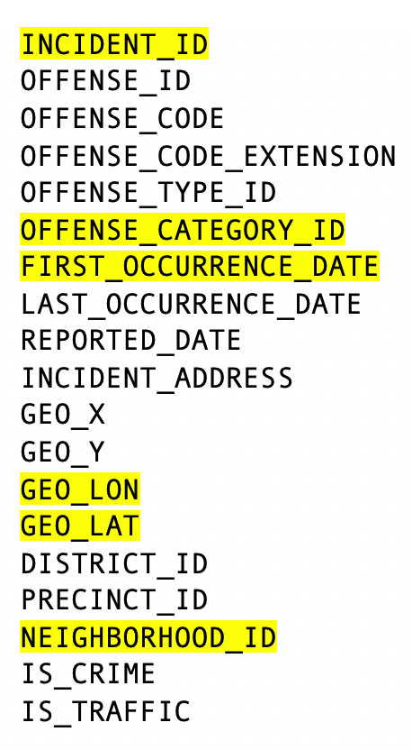
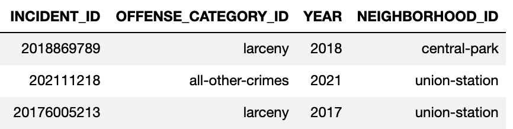
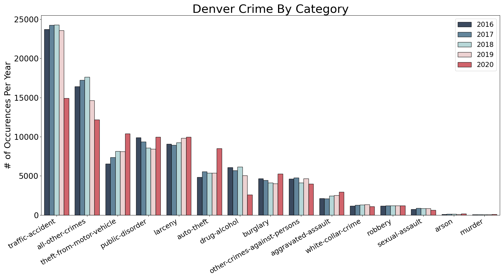
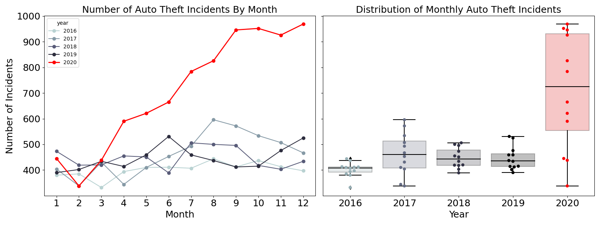
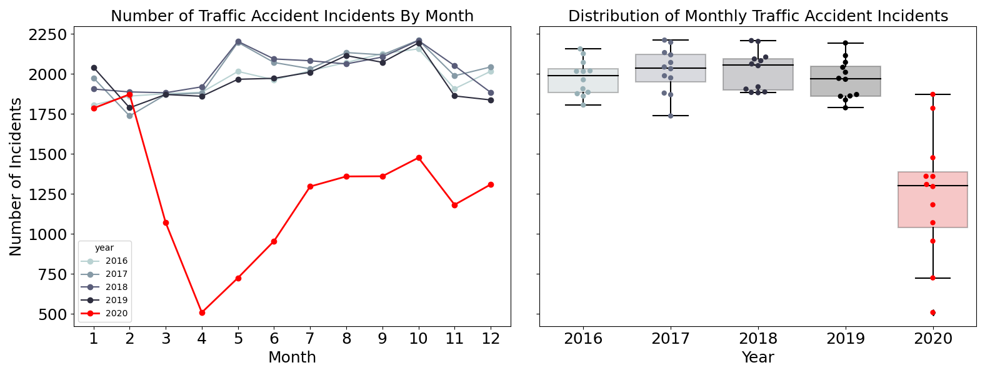
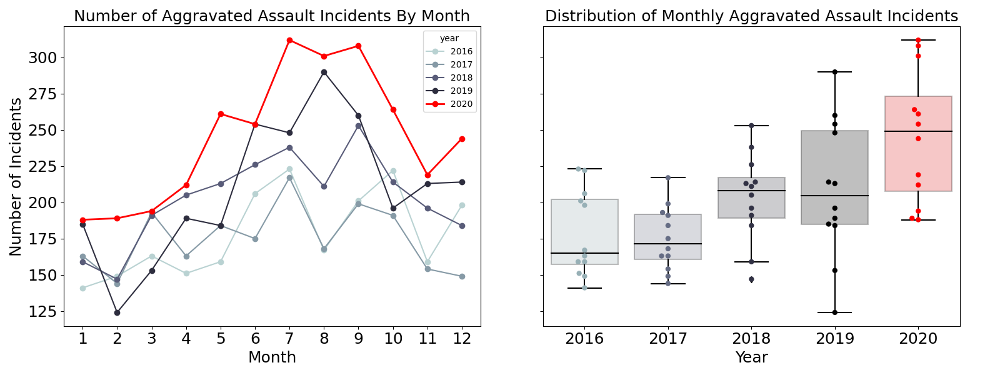
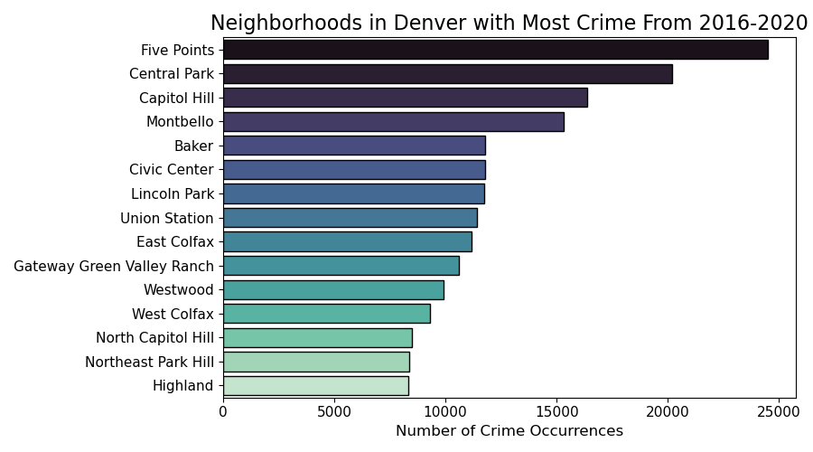
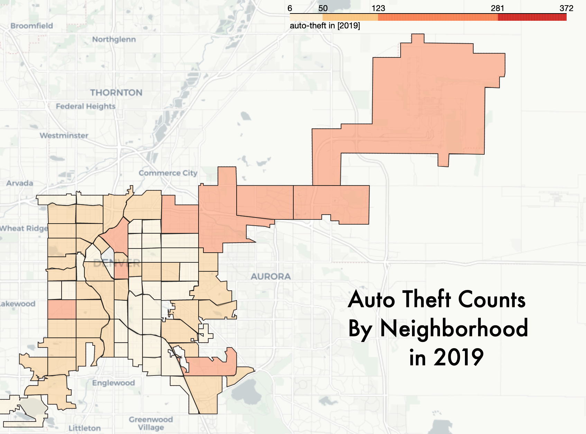
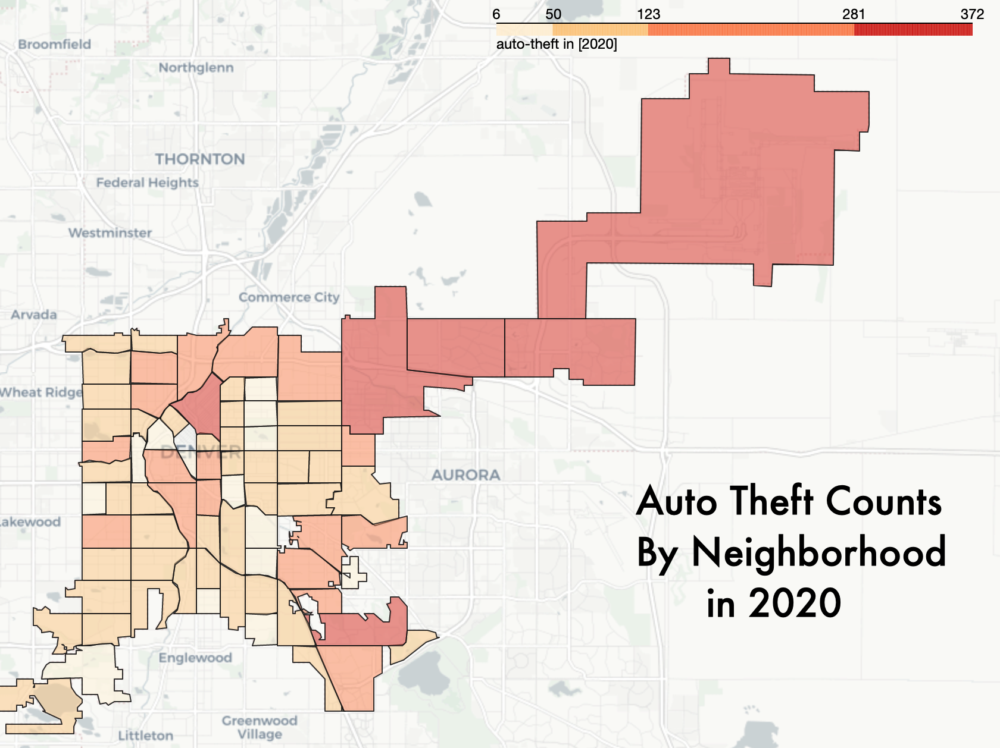

# Denver Crime Trends

## Background & Motivation

In the last year we have seen a dramatic impact on how people live due to COVID-19. In this report, I explore crime data for the City of Denver to understand how and where crime has changed this last year.  Some types of crime have decreased, such as the number of traffic accidents, while other crimes, like automobile theft, have seen a dramatic increase.  Traffic accidents decreased the most in the neighborhood around the Denver International Airport, an area that saw a staggering decrease in traffic this last year.  Part of optimally allocating city resources is understanding 
the distribution of crimes, where they are occuring and being able to adapt to changes that are happening.  This report is a first step toward looking at a few of the largest shifts that have happened this year, and it also serves as documentation on how to use the code within this repository to further explore other trends in Denver.

## Data

I obtained the last five years of criminal offenses in the City and County of Denver, Colorado, which is based on the National Incident Based Reporting Systems (NIBRS) and is publicly available online [here](https://www.denvergov.org/opendata/dataset/city-and-county-of-denver-crime).
 The data includes more than 451,400 reported crimes from 2016-2020. Each crime is classified by offense type and includes the date of first occurrence as well as the reporting date. Most reported crimes also include the neighborhood and geographical location coordinates. Below are features included in the dataset and highlighted are the features I focused on. I also added year, month, and week number features using the date of first occurrence. In accordance with legal protections against identifying sexual assault victims, addresses are not included. Child abuse cases and all crimes involving juveniles are also not reported in this dataset. In August 2020, the Stapleton neighborhood changed its name to Central Park. The new name, Central Park, was replaced in all previous years for consistency. 

 

In order to create a folium choropleth map, I used the Statistical Neigborhoods Shapefile available online [here](https://www.denvergov.org/opendata/dataset/city-and-county-of-denver-statistical-neighborhoods) from the Denver Open Data Catalog.  After cleaning the neighborhood names, I joined this dataframe (pictured on the left) with a subset of the Denver crime dataframe (pictured on the right) in geopandas. 

 

## Exploratory Data Analysis

One of my first goals after preparing the data frame was to assess if crime in Denver had changed in 2020. To examine this question, I plotted the number of incidents for each of the major crime categories in the dataset by year. Looking at the figure below, there is a considerable decline in traffic accidents and drug/alcohol incidents in 2020. There also is an increase in theft from motor vehicles and auto theft in 2020.

To further investigate the changes in auto theft, I plotted the number of incidents for each month over time and total number of monthly incidents by year.  The red line represents the year 2020 and there is a considerable increase in auto theft incidents that starts around March, when the severity of COVID-19 was just being realized in the US.  The boxplot on the right shows just how much this has increased compared to other years.

The number of traffic accidents decreased last year.  In the figure below, we can observe a sharp drop as Covid measures were enacted and more people were staying home. Over time the number of accidents increased but it remained well below its previous levels. More people working from home is likely contributing to this change.  The far-right boxplot shows the extent of this change when compared with other years.

Reviewing theft from motor vehicles we also see an upward trend over 2020. In this instance, there has been an upward trend that appears to level off during 2019, before increasing significantly again in 2020.  March and April appear to be the point at where the increase begins.  Like the other two figures, the boxplot on the right shows the distribution over the year for all 5 years and highlights the notable difference in 2020. 

While the number of aggravated assaults seem to be trending upward over the last few years, there is a cyclical pattern with more incidents occurring in the summer. 

## Where do most crimes occur?

This section focuses where crimes are occurring and provides useful interactive graphics to explore how this is changing between years.
First, when grouping by neighborhood, we can see the top 15 neighborhoods where crimes occur accounts for 41% of all crimes.  In other words, the top 19% of the neighborhoods only account for 41% of total crime. The top 15 neighborhoods account for about 23% of the area of the City and County of Denver based on area calculations from the geometry of the shape file data.

Note: Central Park was formerly known as Stapleton and, as previously mentioned, for the purposed of the analysis it was renamed for all years. 

In order to be able to drill down for a close up on crime in Denver neighborhoods, I made a `folium` map with different crime categories as layers.  The displayed map includes only crimes from 2020.  Due to the large number of incidents I used clusters to allow for easier viewing. Below is a gif of the map. An HTML file containing the map is located in the `html` folder of this repo and can be downloaded and run from your local machine. There are 622 incidents from 2020 in the dataset that are not represented geographically on the map. All but one are sexual crimes for which location data is withheld.

In order to be able to see changes in time across neighborhoods for specific categories, I made a function that creates a `folium choropleth` map.  Below you can see the difference neighborhood by neighborhood for auto-theft incidents in 2019 and in 2020.  Similar analysis can be performed for other categories and years as well.  

While these static maps offer an insight into the changes over time, an interactive version allows for a more detailed exploration with tooltips showing specific statistics that allow a clearer picture of how things have changed.

## Future directions

This document explores how crime has changed in 2020 for the City and County of Denver and provides example graphics for understanding where the crime has changed per category as a choropleth visualization.  Future work could investigate where other categories have changed in Denver and expand upon the visualizations.  Also, are similar changes exhibited in other cities?  It would also be useful to explore other cities to see if they exhibit similar trends.  
