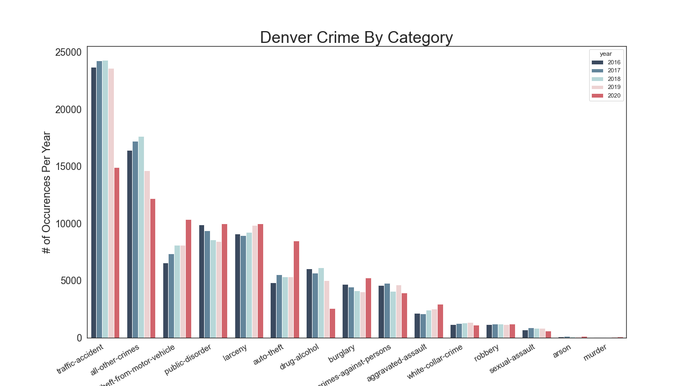
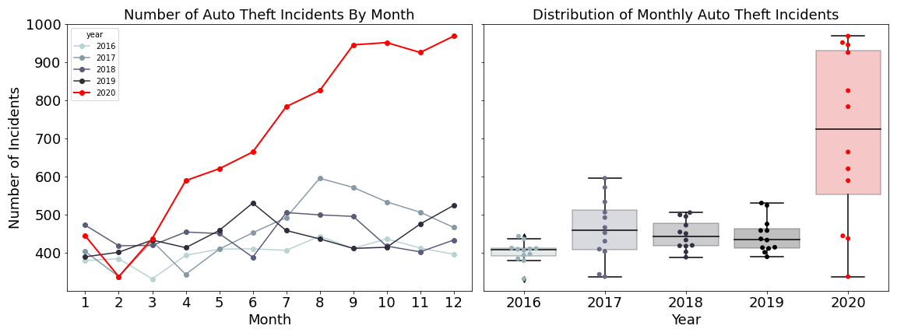
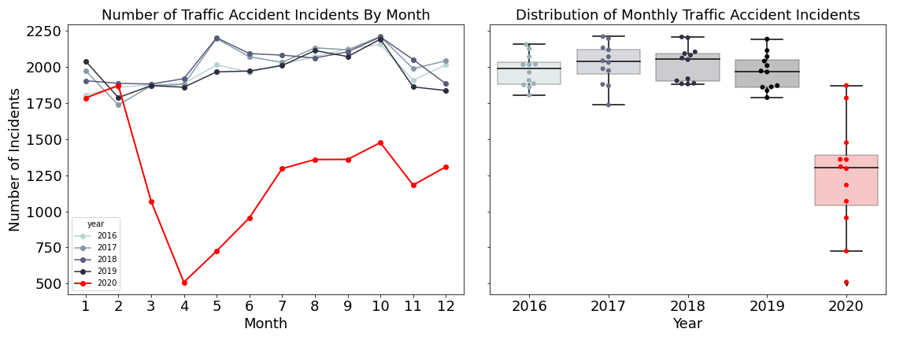
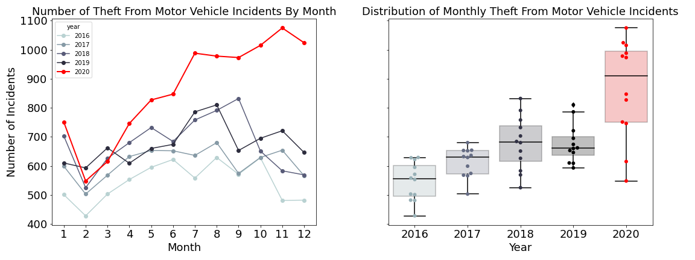
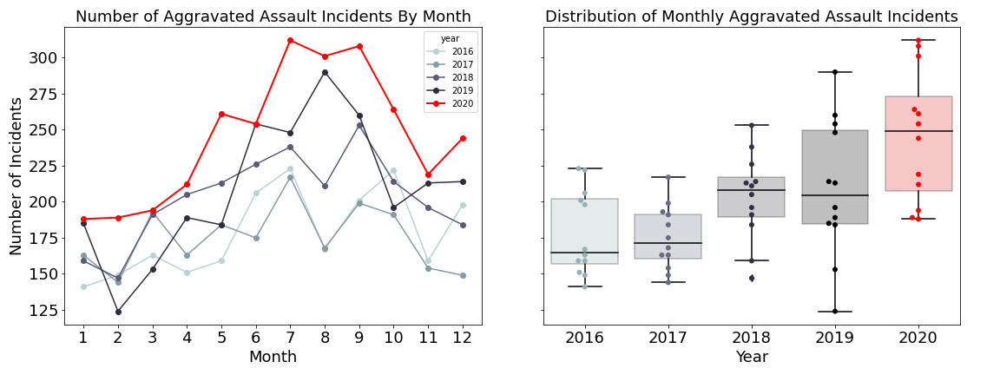
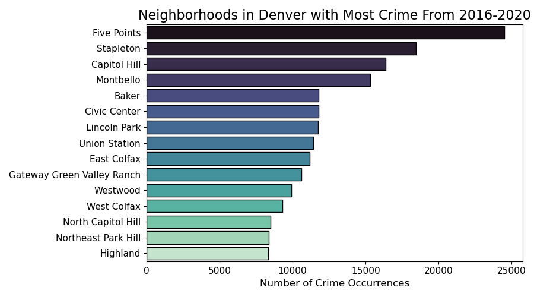

# Capstone1

# Background

From covid to discussions of police funding, 2020 ...

# Data

The dataset includes the last five years of criminal offenses in the City and County of Denver, Colorado. Based on the National Incident Based Reporting System, the dataset is available publically online [here](https://www.denvergov.org/opendata/dataset/city-and-county-of-denver-crime). The data includes more than 451,400 reported crimes from 2016-2020. Each crime is classified by offense type, includes the date of occurence, and reporting date. Most reported crimes also include the neighborhood and geographical location coordinates. In accordance with legal protections against identifying sexual assault victims, addresses are not included. Child abuse cases and all crimes involving juveniles are not reported in this dataset at all. 

Insert cloropleth map???

# Exploratory Data Analysis

Looking at a barchart showing how categories of crime have changed over time, the categories of traffic accidents, theft from motor vehicules, auto theft, and drug/alcohol crimes are noticeably different in 2020. 

Include burglary or alcohol/drug?

## Where do most crimes occur?

Below are the 

# Future directions